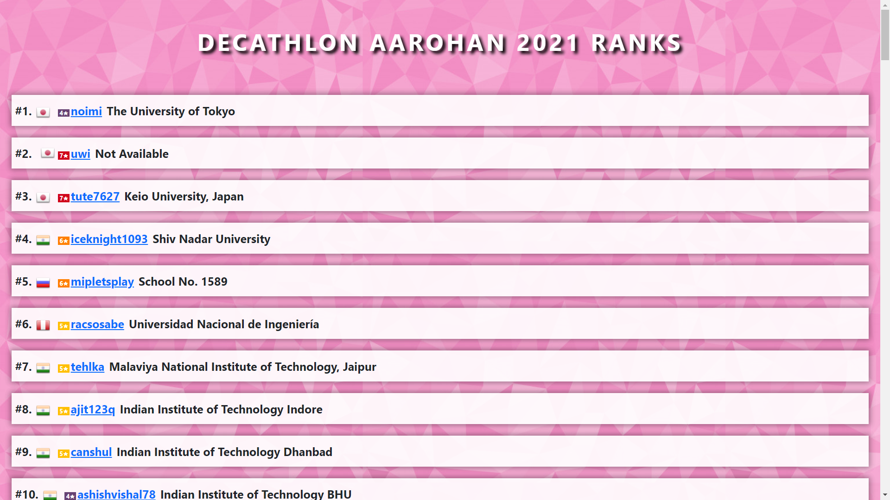
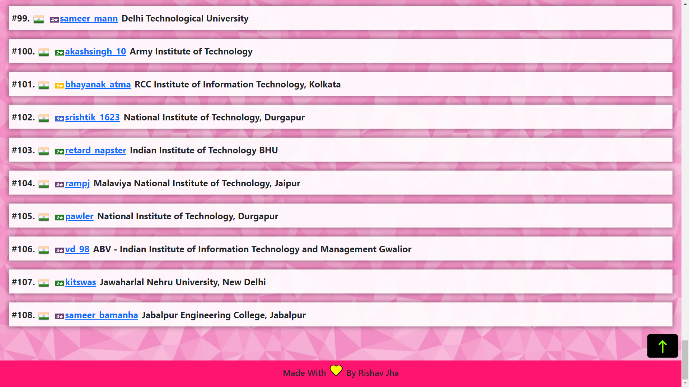
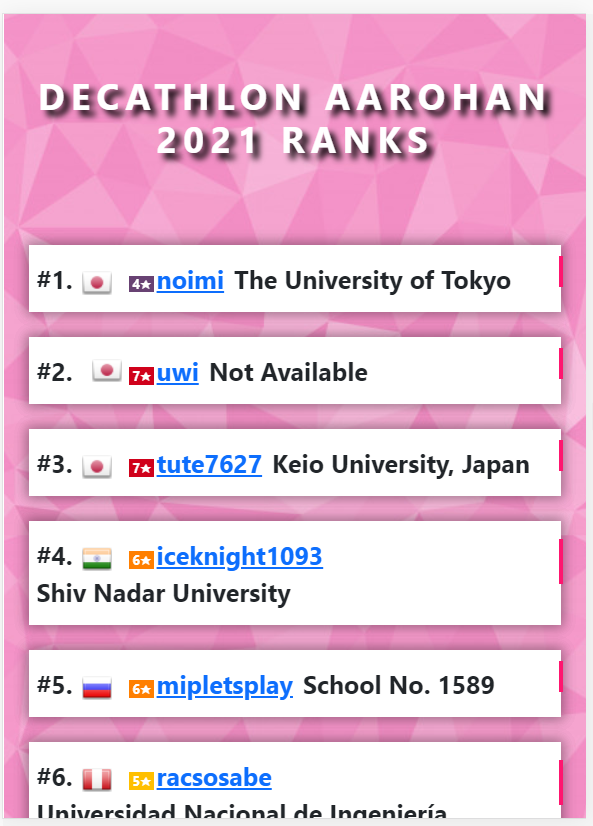
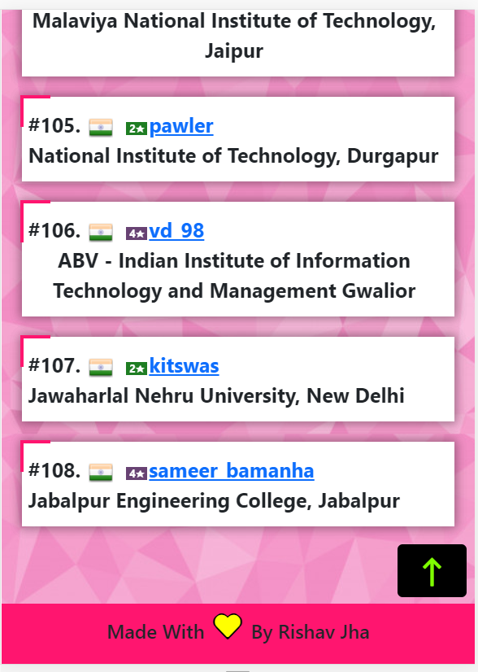

# Decathlon 

# WEBSITE URL - [Decathlon ]() 

# Made Using BOOTSTRAP

## DECATHLON AAROHAN 2021 RANKS

## Pictures -

### PC Version

<br>




<br>
<br>

### Mobile Version -





### As told by my senior i have to give him a list of those participants who were featured in CodeChefs Ranking page(for Decathlon Coding Competiton held during Aarohan in 2021), instead of making a google sheet i decided to make a WEBSITE and here you can click on the username  to got to their profile page in code chef.

Challenges, not much, the data on code chef's page was in HTML tables, i removed those table tags (```<table> <tr> <th>```) and used flex-box to create all of it, thanks to VS CODE, it didnt take much time.
